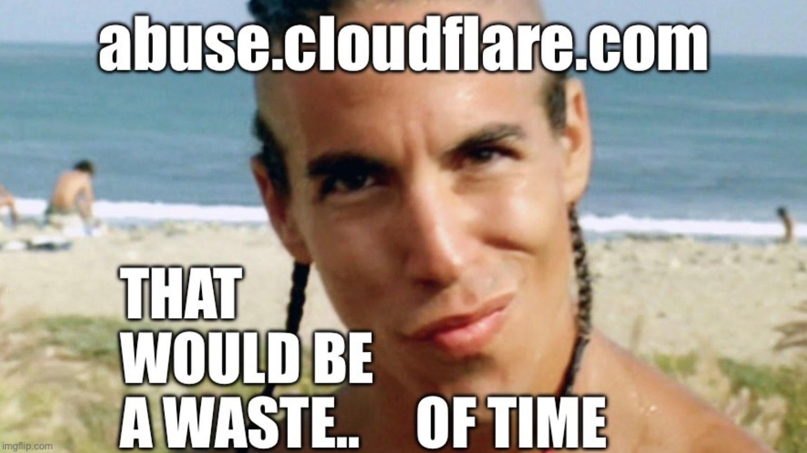

# Security Controls for Cloudflare Abuse 

This is a running list of domains, URLs and other Cloudflare products commonly abused for use in malware and crime. They have been collected into groups based on *regret* for a blocking posture. Tunnel commands and products have been included for threat hunting and building EDR rules.

## Low-Regret Domain & URL Blocks

| Domain / URL | Abuse |
| -- | -- |
| `trycloudflare.com` | Commonly abused by TAs, Shadow Dev/Cloud |
| `cloudflare.com/drop/` | Exfil, Shadow Dev/Cloud |
| `cloudflare-dns.com` | DNS over HTTPS, C2 | 
| `github.com/cloudflare/cloudflared/` | LOTT download |
| `hub.docker.com/r/cloudflare/cloudflared/` | LOTT download |
| `cloudflare-ipfs.com` | C2 |
| `argotunnel.com` | LOTT |
| `cloudflareclient.com` | LOTT |
| `one.one.one.one` | LOTT |

Block (or limit) access to the login at `dash.cloudflare.com`. Especially if you are not a Cloudflare customer. This is a low-regret technique to reduce shadow cloud and dev sprawl on Cloudflare.

## High-Friction Blocks

The following domains are used to host Cloudflare's [geoshitties](geoshitties.txt) and traffic distribution systems. Unfortunately, there is a lot of legitimate web infrastructure riding these technologies without their own private domain. YMMV: Perform web traffic analysis on historical use and deploy block in _rings._

`*.workers.dev`  
`*.pages.dev`  
`*.r2.dev`  

## Cloudflared Tunnel 

### Commands

`winget install --id Cloudflare.cloudflared`

`cloudflared tunnel login`  
`cloudflared tunnel create <tunnel>`  
`cloudflared tunnel run <tunnel>`  

**Tunnel Ingress Rules**
`C:\Users\<YourUser>\.cloudflared\<tunnel-id>.json`

## Resources & Further Reading

[ProofPoint - Threat Actor Abuses Cloudflare Tunnels to Deliver RATs](https://www.proofpoint.com/us/blog/threat-insight/threat-actor-abuses-cloudflare-tunnels-deliver-rats)

[Wu-Tang Mad Libs over DNS](https://github.com/TTLNinja/madlibs) 

[Fortra - Cloudflare’s pages.dev and workers.dev Domains Increasingly Abused for Phishing](https://www.fortra.com/blog/cloudflares-pagesdev-and-workersdev-domains-increasingly-abused-phishing)

[Cofense - IPFS Abuse Continues as Attackers Mix and Match Techniques](https://cofense.com/blog/ipfs-abuse-continues-as-attackers-mix-and-match-techniques/)

[Hunt IO - One Font, Countless Frauds: Exposing Large-Scale Phishing Activity Abusing Cloudflare](https://hunt.io/blog/exposing-large-scale-phishing-activity-abusing-cloudflare)
